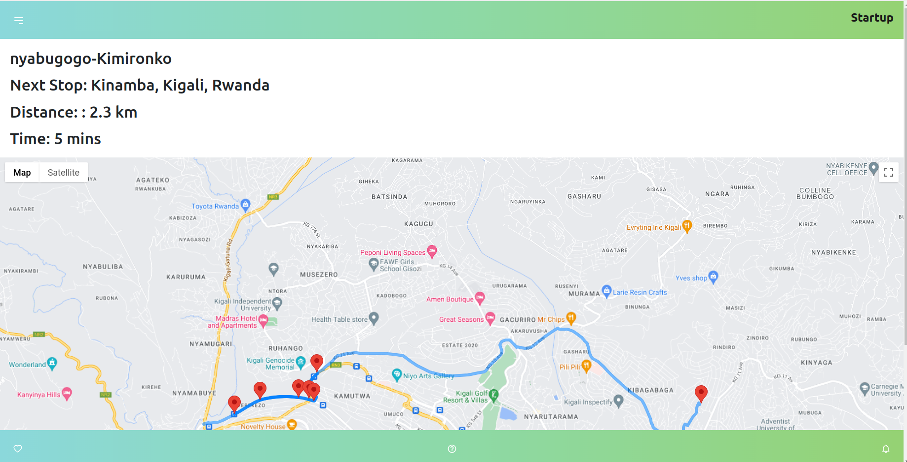
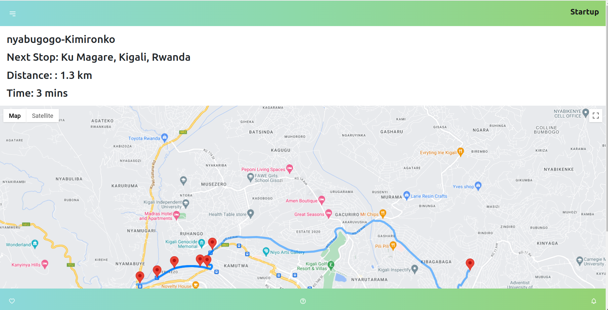
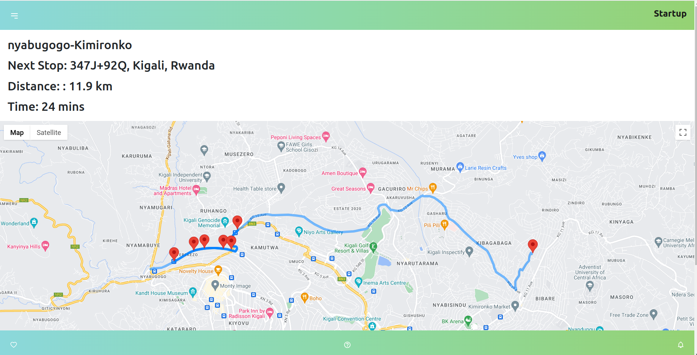

**Real-time Ride-Share Tracking\***

**Overview**

This project aims to provide a real-time ride-sharing tracking solution for transportation agencies operating in Kigali. The web application utilizes the Google Maps API to navigate a predefined route from Nyabugogo to Kimironko, with stops at five intermediate locations. The application dynamically displays the estimated time to reach each upcoming stop along the route. Users can track the movement of the bus, represented by a marker at the origin, as it progresses along the route. By observing the marker's movement and location updates, users can gauge the real-time progress of their journey and anticipate arrival times at each stop. you can access the deployed version of this project https://real-time-ride-sharing.vercel.app/.

**Features**

    Displays the route from Nyabugogo to Kimironko, including intermediate stops.

    Provides real-time updates on the distance and duration to the next stop.

     Utilizes Google Maps API for route navigation and location tracking.

**Getting Started**

To get started with the Real-time Ride-Share Tracking application, you can access the deployed version by following this link: https://real-time-ride-sharing.vercel.app/.

To run the project locally, follow these steps:

    Clone the repository to your local machine:

git clone <repository_url>

Navigate to the project directory:

cd <project_directory>

Install dependencies:

npm install

Set up your Google Maps API key:

    Obtain a Google Maps API key from the Google Cloud Console.

    Add your API key to the .env file:

    makefile

    REACT_APP_API_KEY=YOUR_API_KEY

Start the development server:

    npm start

    Open the web browser and navigate to http://localhost:3000 to view the application.

**Technologies Used**

    React: Front-end framework for building user interfaces.
    Google Maps API: Provides mapping and location services.
    CSS:styling for the web application.

Screenshots

